 <div align="center">



</div>

<p align="center">


  ...
</p>
</div>
<p align="center">
  <a href="https://www.codechef.com/users/kl_2300030557"></a>
  <a href="https://www.hackerrank.com/profile/klu2300030557"></a>
  <a href="https://auth.geeksforgeeks.org/user/user_dm4ubxhqh8u" target="_blank">
    
  </a>
  <a href="https://leetcode.com/klu2300030557/" target="_blank">
    
  </a>
  <a href="https://dev.to/pratyush_kumarpandey_0f5" target="_blank">
    
  </a>
  <br><br>
  <a href="https://www.linkedin.com/in/pratyush-pandey1"></a>
  <a href="https://github.com/its-pratyushpandey?tab=repositories&sort=stargazers">
    
  </a>
  <a href="https://github.com/its-pratyushpandey?tab=followers">
    
  </a>
  <a href="https://prtyush.netlify.app/"></a>
  <a href="https://github.com/its-pratyushpandey?tab=followers">
    
  </a>
</p>


<p align="center">
  <a href="#">
    
  </a>
  <a href="#">
    
  </a>
  <a href="#">
    
  </a>
  <a href="#">
    
  </a>
</p>

<p align="center">
  <b>Building scalable applications • Engineering reliable backends • Exploring AI-powered software</b>
</p>

---

## 👨‍💻 About Me

I'm a **Computer Science & Engineering student at KLEF, Guntur**, with a strong focus on **full-stack development, backend engineering, and AI-powered applications**.

I enjoy turning ideas into production-oriented software — from designing **REST APIs and secure backend systems** to building **AI-powered platforms using LLMs, RAG, and intelligent agents**.

My development journey combines strong fundamentals in **Java, Data Structures & Algorithms, backend architecture, databases, cloud technologies, and modern web development**.

* 🎓 **B.Tech CSE — KLEF, Guntur**
* 📊 **CGPA: 8.62 / 10**
* 💻 **Full-Stack & Backend Development**
* 🤖 **AI / LLM / RAG Enthusiast**
* 🧠 **300+ DSA Problems Solved**
* 🏗️ **70+ GitHub Repositories**
* 🏆 Participated in **3 National-Level Hackathons**

---

## 💼 Current Role

### 🟢 Trainee — Calibo AI Academy

**Currently training and developing expertise in AI, software engineering, and modern enterprise technologies.**

My current focus includes:

* 🤖 Artificial Intelligence & Generative AI
* 🧠 LLMs, RAG & AI Agents
* ☁️ Cloud & DevOps concepts
* 🏗️ Software engineering & scalable application development
* 🔧 Modern development workflows and engineering practices

> **Currently:** Building stronger industry-ready skills through hands-on learning, technical training, and practical development at **Calibo AI Academy**.

---

## ✅ Internship Experience

### 🔵 LLM Post-Training Intern — EtharaAI

**Jan 2026 – May 2026 | Gurugram, India**

Successfully completed an internship focused on **AI and Large Language Model post-training workflows**.

During my internship, I worked on:

* 🧠 LLM post-training workflows
* 📊 Data preparation and response evaluation
* ✍️ Prompt analysis and optimization
* 🤖 Generative AI and NLP workflows
* 🔍 Human-aligned data processing
* 📈 Model-quality improvement activities
* 🤝 Collaboration with mentors and team members

This experience gave me practical exposure to **real-world Generative AI, LLM evaluation, NLP, and AI optimization workflows**.

---

# 🛠️ Technical Skills

### 💻 Languages

<p>


</p>

### 🌐 Frontend

<p>


</p>

### ⚙️ Backend

<p>


</p>

### 🔐 Security & Architecture

<p>


</p>

### 🗄️ Databases

<p>


</p>

### 🤖 AI / ML / LLM

<p>


</p>

### ☁️ Cloud & DevOps

<p>


</p>

---

# 🚀 Featured Projects

## 🎙️ Cogniview — AI Voice Interview & Placement Platform

**Next.js • TypeScript • Firebase • VAPI • REST APIs**

An AI-powered voice interview platform designed to provide interactive placement and interview practice.

**Highlights:**

* 🎤 Real-time voice interview experience
* 🧠 AI-powered interview evaluation
* 📊 Structured scoring and feedback
* 🎯 Role-specific interview insights
* ⚡ Modern responsive interface

---

## 💼 NextHire — AI-Powered Job Portal

**React.js • Node.js • Express.js • MongoDB • WebSockets • JWT**

A full-stack job portal connecting recruiters and job seekers with AI-powered capabilities.

**Highlights:**

* 🔐 Secure authentication & authorization
* 👥 Role-based access control
* 💬 Real-time communication
* 🤖 AI-powered job recommendations
* 🔌 Scalable REST APIs
* ⚡ Backend performance optimization

---

## 📄 Arise — AI Resume & Interview Assistant

**Next.js • Node.js • MongoDB • Gemini AI • REST APIs**

An AI-powered career assistant designed to help candidates improve their resumes and prepare for interviews.

**Highlights:**

* 📊 ATS resume scoring
* 🤖 AI-powered feedback
* 🎤 Mock interview assistance
* 🧠 Personalized recommendations
* 🔐 Secure backend APIs
* ⚡ Optimized database operations

---

# 🏆 Achievements

| Achievement          | Highlights                                               |
| -------------------- | -------------------------------------------------------- |
| 🧠 **DSA**           | 300+ problems solved                                     |
| 💻 **GitHub**        | 70+ repositories                                         |
| 📈 **Contributions** | 1,200+ contributions                                     |
| 🏆 **Hackathons**    | 3 national-level hackathons                              |
| 👥 **Leadership**    | Led a team of 5                                          |
| 🎯 **Events**        | Technical events & coding contests for 200+ participants |

### 🏅 Hackathons

* Smart India Hackathon
* HackVega
* Tata Imagination Challenge

---

# 📜 Certifications

* 🟢 **MongoDB Certified Developer – Associate — 2025**
* ☁️ **Oracle Cloud Infrastructure Certified Developer Professional — 2025**
* 🤖 **Salesforce Certified AI Associate — 2025**
* 🌐 **Cambridge Linguaskill English Certification — 2024**

---

# 📚 Currently Focused On

```text
┌─────────────────────────────────────────────────────┐
│                                                     │
│  ☕ Advanced Java & Spring Boot                     │
│  🏗️ Scalable Backend Architecture                  │
│  🤖 Generative AI & LLM Applications                │
│  🔎 RAG & AI Agents                                 │
│  ☁️ Cloud & DevOps                                  │
│  🧩 Microservices & Distributed Systems              │
│  🧠 Data Structures & Algorithms                    │
│                                                     │
└─────────────────────────────────────────────────────┘
```

---

# 💡 What I Like Building

```text
AI-Powered Applications
        ↓
Scalable Backend Systems
        ↓
REST APIs & Microservices
        ↓
Secure Authentication
        ↓
Modern Full-Stack Interfaces
        ↓
Cloud-Ready Applications
```

I particularly enjoy working at the intersection of **software engineering and artificial intelligence**, where backend systems, modern web applications, and AI capabilities come together.

---

# 🤝 Let's Connect

<p align="center">

<a href="#">

</a>

<a href="#">

</a>

<a href="#">

</a>

<a href="mailto:pratyush.me.ai@gmail.com">

</a>

</p>

<p align="center">
  <b>💻 Build. Learn. Solve. Repeat. 🚀</b>
</p>

<p align="center">
  <i>Thanks for visiting my profile!</i>
</p>


### 🌐 Portfolio & Resources

- **Portfolio:** [prtyush.netlify.app](https://prtyush.netlify.app/)
- **Resume:** [View Here](https://drive.google.com/file/d/1WFIrbopURE5SHz8nAkPmEmqe9QfWZJlF/view?usp=drive_link)
- **Email:** pratyush.me.ai@gmail.com


## 🤝 Looking to Collaborate On

- MERN Stack & Spring Boot APIs
- Microservices Architecture
- AI-integrated Web Apps
- Hackathons | Open Source | Team Projects


### 😄 **Fun Fact**

> _I turn complex code into clean, scalable apps — and still manage to laugh at my own debugging jokes._


<!-- Colorful Blobs Divider (Section Break) -->

<!-- Simple Colored Wave Divider -->


---


<!-- 
  💡 Tip: The use of <div> and inline styles ensures the layout remains responsive and visually appealing on different screen sizes. 
  For more advanced responsiveness, consider using custom CSS or a markdown-to-HTML renderer that supports media queries.
-->
[](https://visitcount.itsvg.in)

<!-- Proudly created with GPRM ( https://gprm.itsvg.in ) -->

